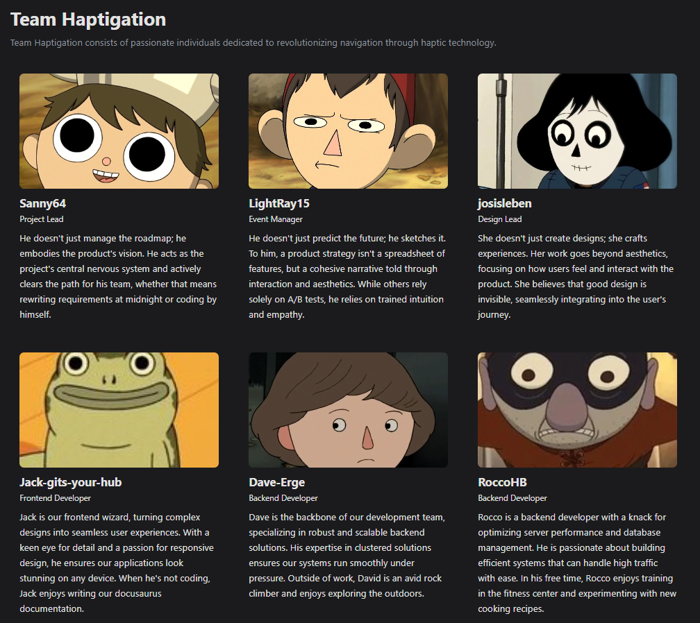

# Haptigation

<!-- 
This README serves as the organization's profile page on GitHub.
Replace the placeholder content below with information about your organization.
-->

## 👋 Welcome

Welcome to the **Haptigation** organization! This is a student project of junior staff at Deutsche Telekom. The stuff we are working on here is part of our grade in one of the modules of our bachelor's degree.

If you're interested about the project, feel free to read our [Documentation](https://haptigation-student-project.github.io/Documentation/)

## 🎯 Our Mission

With Haptigation, we're developing a hardware accessory that can be paired to your phone to give you directions through the haptigation app via vibration wristbands, allowing people to navigate without having to look at their phone or use headphones to recieve instructions.

## 🚀 Repository overview

<!-- Here, we can list our (most important) repos -->

| Repo | Description |
|---------|-------------|
| [Software](https://github.com/Haptigation-Student-Project/Software) | Main software repository, private due to confidentiality constraints |
| [Hardware](https://github.com/Haptigation-Student-Project/Hardware) | Main hardware repository, private due to confidentiality constraints |
| [Google Apps Script](https://github.com/Haptigation-Student-Project/Google-Apps-Script) | Gmail automation logic to make our project mail feel professional |

## 👥 Our Team

| Person | Tasks |
|---------|------|
| David | Software Engineer |
| Jack | Software Engineer |
| Josi | Software Engineer |
| Patrick | Software Engineer, Scrum Master |
| Rocco | Hardware Engineer |
| Sanny | Hardware Engineer, Product Owner |

## 📫 Contact Us

Contact us via haptigation@gmail.com

Feel free to subscribe to our bi-weekly newsletter by leaving your mail in one of our [Menti Surveys](https://www.menti.com/alx5ib81p2uv)

Or by sending us a mail confirming intereset in the newsletter.

---

The copyright to the products of this project are owned solely by [Deutsche Telekom](https://www.telekom.de/start).

*This organization is maintained by students as part of the 3-year undergraduate program of the* 

**[Provadis School of International Management and Technologies](https://www.provadis-hochschule.de/).**